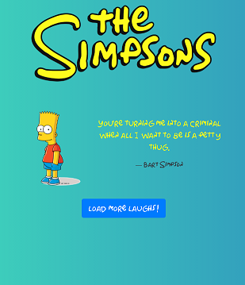
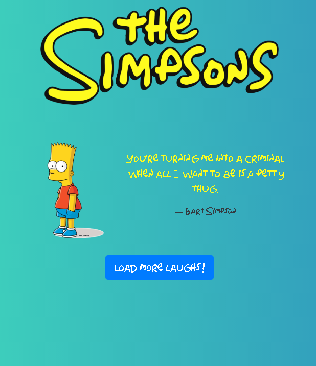

# simpson-app
this app is a simple vue.js introduction about some directives. To check more live examples and docs, visit [vuejs.org](https://vuejs.org).
[demo preview.](https://simpson-app-b7e04.firebaseapp.com).

 below some screenshots of app.  preview load quote and not connection to server.

    
